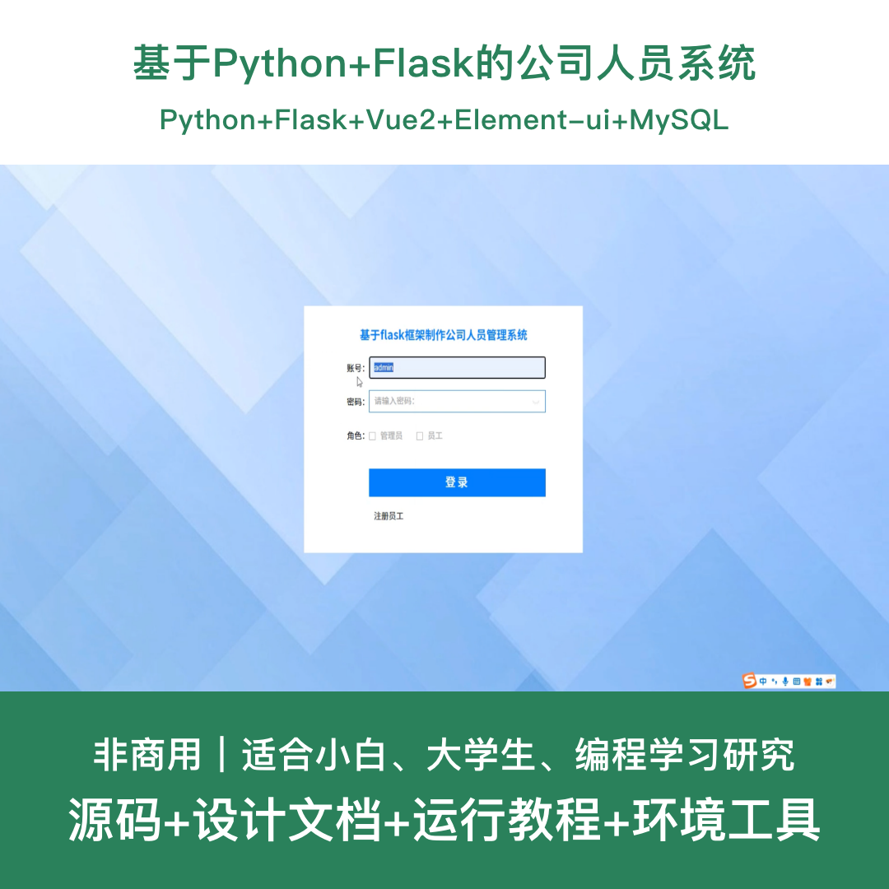
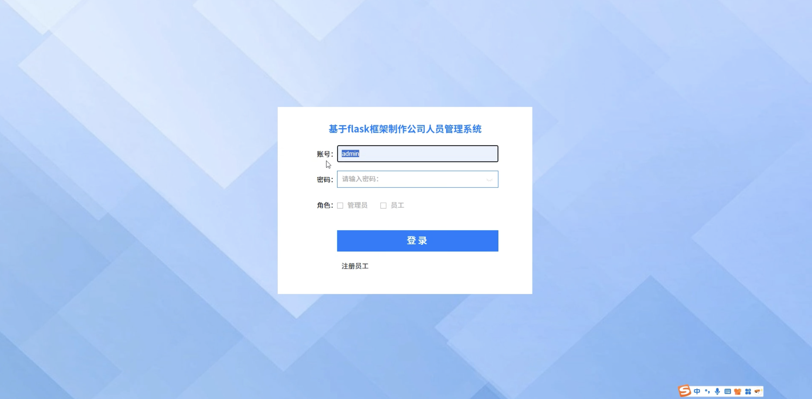
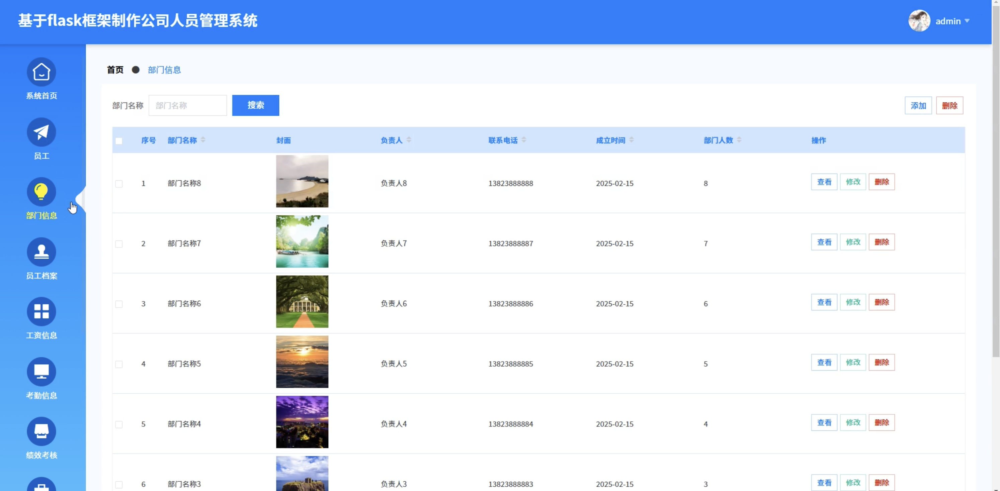
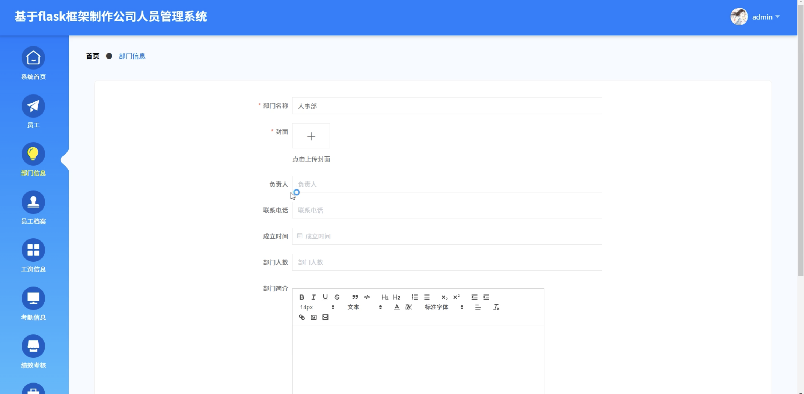
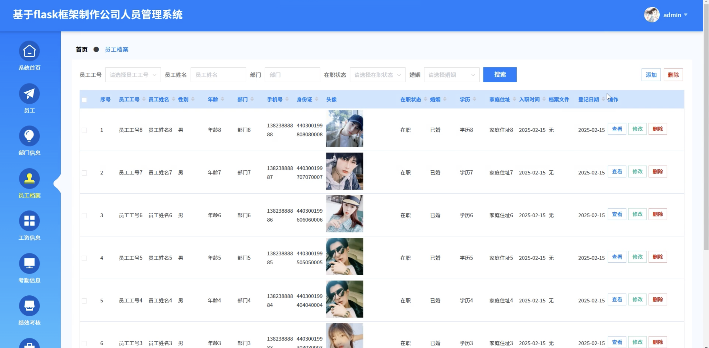
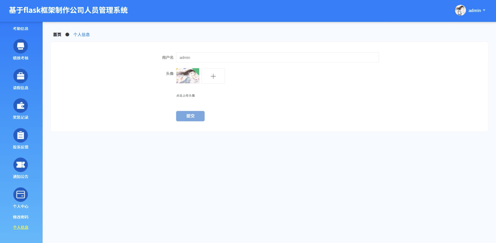
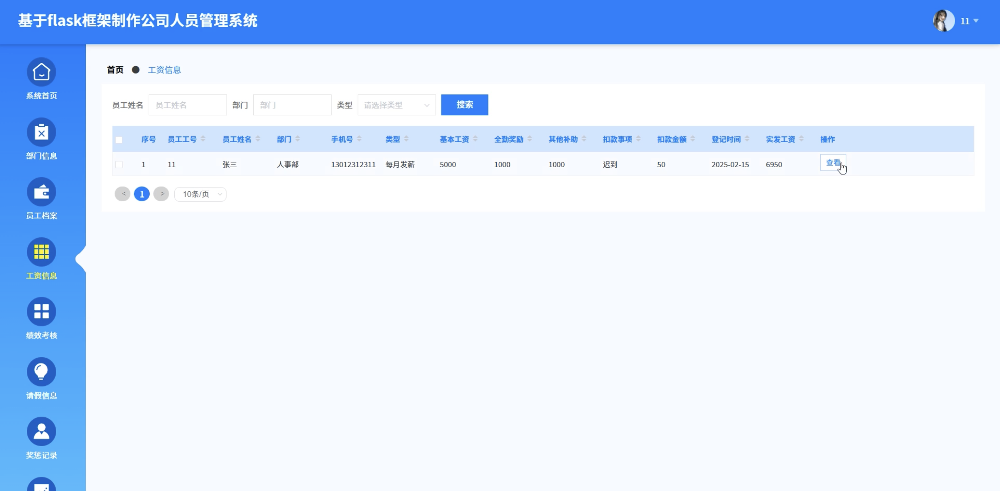
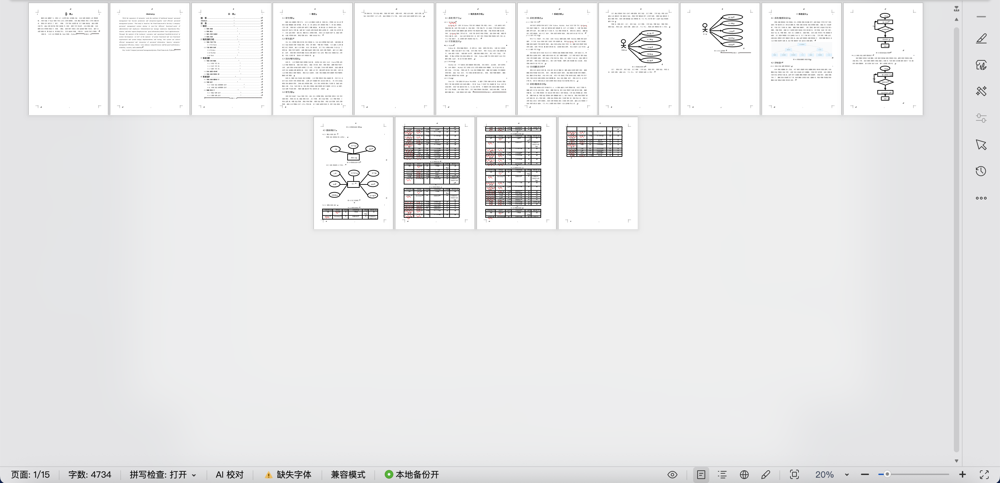

# python130D
python130D基于Python+Flask的公司人员管理系统+LW
 
## 源码问题查看主页咨询

### 一、关键词
公司人员管理系统、员工管理系统、人事管理系统、企业人员系统、部门管理系统

### 二、作品包含
源码+数据库+设计文档+全套环境和工具资源+本地部署教程

### 三、项目技术
前端技术： Html、Css、Js、Vue2.6、Element-ui
后端技术：Python、Flask、PyMySQL

### 四、运行环境（以下版本亲测，其他版本兼容性请自行测试）
开发工具：PyCharm + VSCODE

数据库：MySQL 5.7+

数据库管理工具：Navicat10以上版本

环境配置软件：Python 3.7+

前端Nodejs：14+

浏览器：谷歌浏览器

### 五、项目介绍
项目编号：python130D

基于Python+Flask的公司人员管理系统，提供完善的员工信息管理、部门管理、档案管理等功能，方便企业进行人员信息化管理，提升人事管理效率。

角色：管理员、员工

员工功能：登录、个人信息查看、档案管理、投诉反馈、公告查看、考勤管理、薪酬查看。

管理员功能：登录、员工管理、部门管理、档案管理、考勤管理、薪酬管理、投诉反馈处理、公告管理。

数据库表：12张

### 六、运行截图

